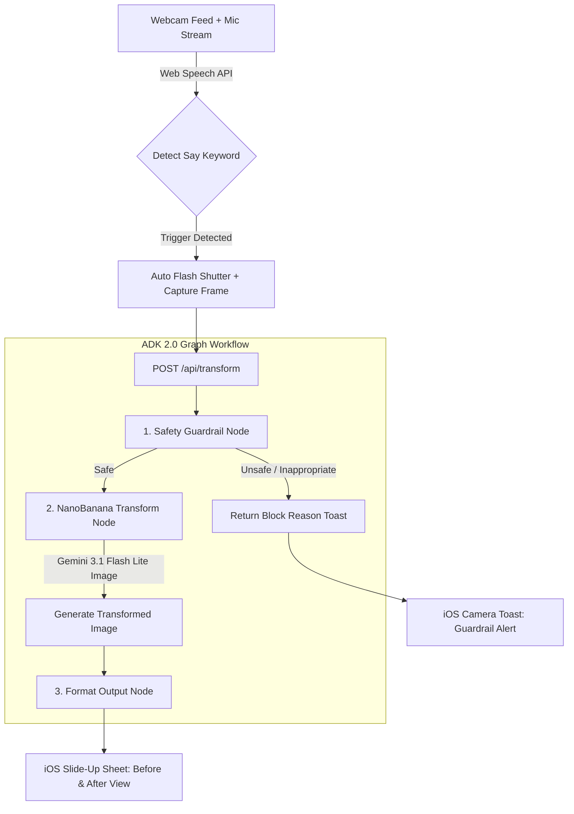

# Say "00" Cam (Voice Subject Transformer)

[](https://say-00-cam.cowcowwow.kr)
[](https://github.com/mommocmoc/say-00/actions/workflows/ci.yml)
[](https://github.com)
[](https://adk.dev)
[](https://ai.google.dev)
[](https://fastapi.tiangolo.com)
[](LICENSE)

---

## 🔗 Live Demo (라이브 데모)

### ▶️ **[https://say-00-cam.cowcowwow.kr](https://say-00-cam.cowcowwow.kr)**

설치 없이 브라우저에서 바로 실행됩니다. 카메라·마이크 권한을 허용한 뒤 **"세이 치즈"** 또는 **"Say Cheese"** 라고 말해보세요.

> 💡 음성 인식에 Web Speech API를 사용하므로 **Chrome / Edge / Safari**에서 가장 안정적으로 동작하며, 카메라 접근을 위해 HTTPS 연결이 필요합니다.

배포 환경: **Google Cloud Run** (`asia-northeast1`) — API 키는 GCP Secret Manager로 주입됩니다.

---

## 📌 Overview (개요)

[한글]
**Say "00" Cam**은 사용자가 마이크로 **"Say [피사체 유형]"** (예: *Say "Cheese"*, *Say "Stone"*, *Say "Candy"*)을 외치면, 자동으로 사진이 찍히고 원본 사진 속 메인 피사체를 사용자가 말한 피사체 형태 및 재질로 자동 변환해 주는 아이폰 카메라 스타일의 음성 AI 포트폴리오 프로젝트입니다.

[English]
**Say "00" Cam** is an iOS-style voice-activated AI camera application developed as a personal portfolio project. When a user speaks a command like **"Say [Subject Type]"** (e.g., *Say "Cheese"*, *Say "Stone"*, *Say "Candy"*), the camera automatically captures a photo and transforms the main subject into the requested material or form using Google ADK 2.0 Graph Workflow and Gemini Multimodal AI.

---

## ✨ Key Features (주요 기능)

1. **🎙️ Siri-Style Continuous Voice Activation (실시간 시리 스타일 음성 인식)**
   - Web Speech API 기반으로 백그라운드에서 `"Say [피사체]"` 또는 `"세이 [피사체]"` 발화를 실시간 감지하여 자동 촬영 및 셔터 애니메이션을 실행합니다.
   - 발화가 완료된 정식 결과(`isFinal`)에만 반응하여 "솜사탕" 발화 중 "솜", "솜사"와 같은 중간 텍스트에 의한 중복 연쇄 촬영을 완벽히 방지합니다.

2. **🛡️ ADK 2.0 Graph Safety Guardrail Node (2단계 하이브리드 유해성 검증)**
   - **1단계 (Zero-Latency Guardrail)**: 선정성(나체, 누드), 잔혹성/폭력성(시체, 살인), 불법/마약 등의 키워드를 0.001초 만에 즉시 차단합니다.
   - **2단계 (Gemini LLM Guardrail)**: `GEMINI_API_KEY` 설정 시 `gemini-3.5-flash-lite` LLM이 맥락(Context)을 심층 평가하여 억측 과잉 차단 없이 정교하게 2차 필터링합니다.

3. **🎨 Gemini AI Multimodal Subject Transformation (NanoBanana Engine)**
   - **`gemini-3.1-flash-lite-image`** 모델을 직접 호출하여 원본 사진의 구도와 배경을 유지한 채 메인 피사체를 실감 나는 재질로 생성 및 합성합니다.

4. **📱 iOS Native Camera UI & Quota-Safe History Gallery**
   - 아이폰 카메라 앱과 동일한 풀스크린 뷰파인더, 이중 링 셔터 버튼, 전/후면 카메라 전환 지원.
   - iOS 스타일 하단 슬라이드업 시트로 원본(`Original`) ↔ 변환(`Transformed`) 사진 탭 비교 및 고화질 다운로드 제공.
   - LocalStorage 5MB 용량 제한을 우회하기 위해 280px 썸네일 자동 경량화 압축 기술 적용.

---

## 📐 Architecture & Workflow Graph (아키텍처 및 ADK 2.0 그래프)



---

## 📁 Directory Structure (디렉토리 구조)

```text
say-00/
├── AGENT.md                       # Project agent specification & style guide
├── README.md                      # Multilingual documentation (국문/영문)
├── LICENSE                        # MIT License file
├── requirements.txt               # Runtime dependencies
├── requirements-dev.txt           # Test & lint dependencies
├── pytest.ini                     # Pytest configuration (asyncio auto mode)
├── .env.example                   # Environment variable template
├── Dockerfile                     # Cloud Run production image
├── cloudbuild.yaml                # GCP CI/CD build & deploy pipeline
├── deploy.sh                      # One-click Cloud Run deploy (Secret Manager)
├── Procfile                       # Render / Heroku process definition
├── backend/
│   ├── main.py                    # FastAPI REST API & Static File Server
│   ├── agent.py                   # ADK 2.0 Agent Entrypoint (root_agent, runner)
│   └── services/
│       ├── safety_service.py      # ADK Guardrail Node (Blocklist & LLM Moderation)
│       ├── profanity_words.json   # 4-category bilingual blocklist dataset
│       └── nanobanana_service.py  # Gemini Image Engine (gemini-3.1-flash-lite-image)
├── frontend/
│   ├── index.html                 # iOS Native Camera UI Layout
│   ├── style.css                  # iOS Design System, Animations & Glassmorphism
│   └── app.js                     # Speech recognition, Camera controls & Sheet Modals
├── tests/
│   ├── conftest.py                # Offline fixtures (no Gemini call required)
│   ├── test_safety_service.py     # Blocklist guardrail coverage
│   └── test_agent_graph.py        # ADK graph edge-routing coverage
└── scripts/
    └── download_datasets.py       # Rebuilds the open-source blocklist dataset
```

---

## 🚀 Quick Start (설치 및 실행 방법)

### 1. Repository Setup & Virtual Environment (환경 설정)
```bash
# Repository Clone or Directory Navigation
cd say-00

# Create Python Virtual Environment
python3 -m venv .venv
source .venv/bin/activate

# Install Dependencies via requirements.txt
pip install -r requirements.txt
```

### 2. Environment Variable Configuration (Gemini API 키 설정)
`.env.example` 파일을 복사하여 `.env` 파일을 작성하고 발급받은 Gemini API 키를 입력합니다:
```env
GEMINI_API_KEY=AIzaSy...your_gemini_api_key_here...
```

### 3. Run FastAPI Backend Server (백엔드 및 웹 앱 실행)
```bash
source .venv/bin/activate
uvicorn backend.main:app --host 127.0.0.1 --port 8000 --reload
```

웹 브라우저에서 `http://127.0.0.1:8000`으로 접속하여 서비스를 이용합니다.

### 4. Run Tests & Lint (테스트 및 린트)
```bash
pip install -r requirements-dev.txt

pytest          # 14 tests — 전부 오프라인, API 키 불필요
flake8 backend/ tests/
```

테스트는 Gemini를 호출하지 않습니다. 가드레일 1단계(블록리스트)는 네트워크 이전에 단락되고, ADK 그래프 테스트는 서비스 계층을 스텁으로 대체하여 **엣지 라우팅 자체**를 검증합니다 — 차단된 키워드가 변환 노드에 도달하지 않는지까지 확인합니다.

---

## 👤 Project Info & License (프로젝트 정보 및 라이선스)

- **Author**: JaeHwan So
- **Project Type**: Personal Portfolio Project (개발자 개인 포트폴리오 프로젝트)
- **License**: [MIT License](LICENSE) (상업적 이용, 수정, 재배포 자유 및 출처 표기)
- **Code Style**: Google Python Style Guide (flake8 100% Pass)
